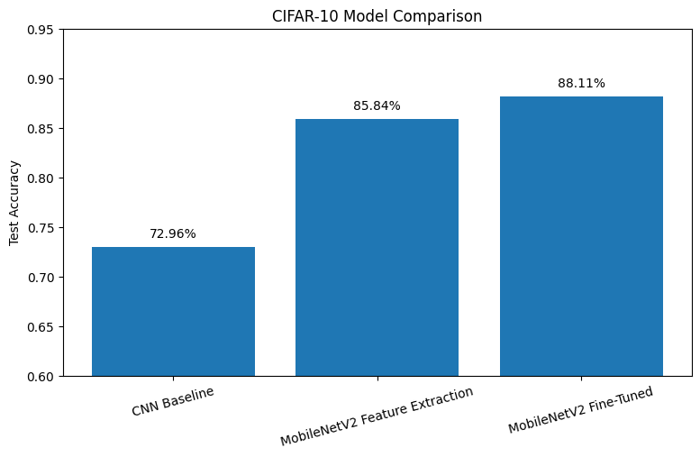
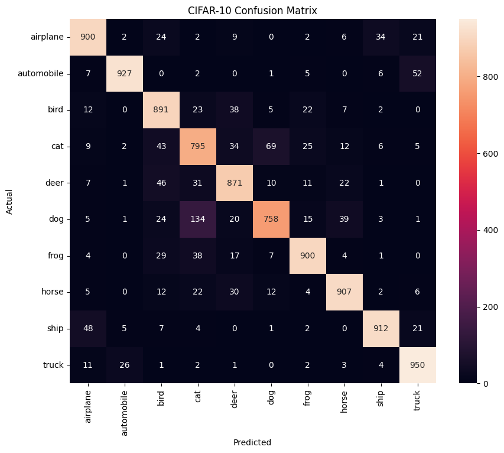
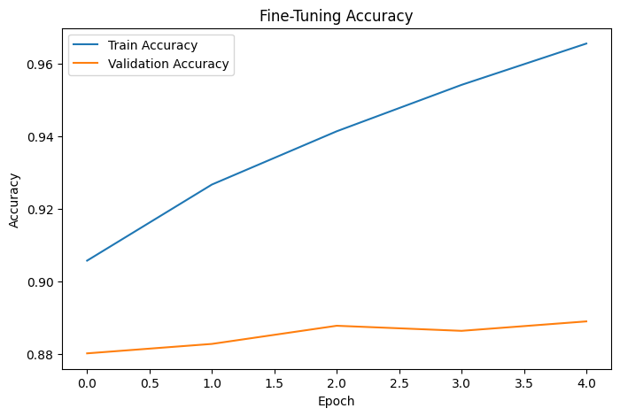
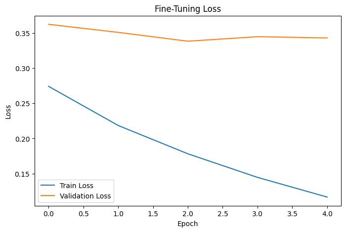

# CIFAR-10 Image Classification using Transfer Learning

A deep learning project comparing a CNN trained from scratch with ImageNet-pretrained MobileNetV2 for CIFAR-10 image classification.

The project covers data preprocessing, augmentation, CNN architecture design, transfer learning, feature extraction, selective fine-tuning, model evaluation, confusion matrix analysis, and error analysis.

---

## 📌 Project Overview

CIFAR-10 is a dataset containing 60,000 color images belonging to 10 different classes.

Each image has a resolution of **32 × 32 pixels** with **3 RGB channels**.

The objective of this project is to build an image classification pipeline and investigate how much **transfer learning** can improve performance compared with a CNN trained from scratch.

Three approaches were evaluated:

1. CNN trained from scratch
2. MobileNetV2 with ImageNet pretrained weights using feature extraction
3. MobileNetV2 with selective fine-tuning

---

## 🎯 Objectives

The main objectives of this project were:

- Understand the CIFAR-10 dataset
- Implement a CNN classifier from scratch
- Apply image preprocessing and augmentation
- Understand transfer learning
- Use an ImageNet-pretrained MobileNetV2 model
- Perform feature extraction with a frozen backbone
- Perform selective fine-tuning
- Compare different training strategies
- Evaluate classification performance
- Analyze class-wise errors using a confusion matrix
- Investigate overfitting during fine-tuning
- Build a reproducible and portfolio-ready deep learning project

---

## 📊 Dataset

The CIFAR-10 dataset contains:

| Property | Value |
|---|---:|
| Total Images | 60,000 |
| Training Images | 50,000 |
| Test Images | 10,000 |
| Image Size | 32 × 32 |
| Channels | 3 (RGB) |
| Number of Classes | 10 |
| Images per Class | 6,000 |

### Classes

The ten classes are:

- Airplane
- Automobile
- Bird
- Cat
- Deer
- Dog
- Frog
- Horse
- Ship
- Truck

---

## 🔍 Data Preprocessing

The CIFAR-10 files were loaded from the official CIFAR-10 Python dataset format.

The original images are stored as flattened arrays containing:

```text
3072 values = 32 × 32 × 3
```

The data was reshaped into:

```text
(N, 32, 32, 3)
```

where:

- `N` = number of images
- `32 × 32` = spatial dimensions
- `3` = RGB channels

### Normalization

Pixel values originally range from:

```text
0 – 255
```

They were converted to `float32` and normalized to:

```text
0 – 1
```

using:

```python
X_train = X_train.astype("float32") / 255.0
X_test = X_test.astype("float32") / 255.0
```

---

## ✂️ Training and Validation Split

The original 50,000 training images were divided into:

| Split | Images |
|---|---:|
| Training | 45,000 |
| Validation | 5,000 |
| Test | 10,000 |

A stratified split was used so that the class distribution remained consistent between the training and validation sets.

The test set was kept completely separate and was only used for final evaluation.

---

## 🔄 Data Augmentation

Data augmentation was used to improve generalization and reduce overfitting.

The following augmentations were applied during training:

- Random horizontal flipping
- Small random translations

The test dataset was not augmented.

The augmentation pipeline was incorporated into the model so that transformations were applied dynamically during training.

---

# 🧠 Model 1 — CNN Baseline

A custom CNN was first trained from scratch to establish a baseline.

### Architecture

```text
Input: 32 × 32 × 3

        ↓

Random Horizontal Flip
        ↓
Random Translation
        ↓
Conv2D — 32 filters, 3×3, ReLU
        ↓
MaxPooling — 2×2
        ↓
Conv2D — 64 filters, 3×3, ReLU
        ↓
MaxPooling — 2×2
        ↓
Flatten
        ↓
Dense — 128, ReLU
        ↓
Dense — 10, Softmax
```

### Parameter Calculation

The trainable parameters were:

| Layer | Parameters |
|---|---:|
| Conv2D (32 filters) | 896 |
| Conv2D (64 filters) | 18,496 |
| Dense (128 units) | 524,416 |
| Dense (10 units) | 1,290 |
| **Total** | **545,098** |

### Training Configuration

- Optimizer: Adam
- Loss: Sparse Categorical Crossentropy
- Batch size: 64
- Epochs: 10
- Input size: 32 × 32 × 3

### Baseline Performance

**Test Accuracy: 70.81%**

**Test Loss: 0.8460**

This baseline provides a reference point for evaluating the benefits of transfer learning.

---

# 🚀 Model 2 — MobileNetV2 Feature Extraction

The second approach used **MobileNetV2 pretrained on ImageNet**.

MobileNetV2 was selected because it provides a strong pretrained visual representation while remaining relatively lightweight and computationally efficient.

### Why Transfer Learning?

Training a deep CNN from scratch requires the model to learn visual features from the beginning.

An ImageNet-pretrained model has already learned useful features such as:

- Edges
- Corners
- Textures
- Shapes
- Object parts
- Higher-level visual patterns

These learned representations can be reused for a new classification problem.

---

## 🏗️ MobileNetV2 Setup

MobileNetV2 was loaded with:

```python
tf.keras.applications.MobileNetV2(
    weights="imagenet",
    include_top=False,
    input_shape=(96, 96, 3)
)
```

Since CIFAR-10 images are only **32 × 32**, the images were resized to:

```text
96 × 96 × 3
```

before being passed to MobileNetV2.

The pretrained ImageNet classification head was removed using:

```python
include_top=False
```

A new classification head for the 10 CIFAR-10 classes was then added.

---

## 🧩 Transfer Learning Architecture

```text
Input: 32 × 32 × 3
        ↓
Resize to 96 × 96
        ↓
Rescale to [-1, 1]
        ↓
MobileNetV2 Backbone
        ↓
Global Average Pooling
        ↓
Dense — 10, Softmax
```

Global Average Pooling was used instead of Flatten.

MobileNetV2 produces:

```text
3 × 3 × 1280
```

feature maps.

Global Average Pooling converts this into:

```text
1280
```

features.

The final classification layer therefore contains:

```text
(1280 + 1) × 10 = 12,810 parameters
```

This keeps the classification head compact and reduces unnecessary parameters.

---

## 🔒 Feature Extraction Strategy

During the first stage of transfer learning, the MobileNetV2 backbone was frozen.

Only the newly added CIFAR-10 classification head was trained.

This allowed the model to reuse the pretrained ImageNet features without immediately modifying them.

### Feature Extraction Performance

**Test Accuracy: 85.91%**

**Test Loss: 0.4139**

Compared with the baseline CNN:

```text
70.81% → 85.91%
```

### Improvement

**+15.00 percentage points**

This demonstrated the significant benefit of using pretrained visual features.

---

# 🔧 Model 3 — Selective Fine-Tuning

After feature extraction, selective fine-tuning was performed.

The goal was to allow some deeper MobileNetV2 layers to adapt to CIFAR-10 while keeping most of the pretrained representation fixed.

---

## Fine-Tuning Strategy

MobileNetV2 contains **154 layers**.

The fine-tuning strategy was:

- Keep the majority of early layers frozen
- Consider approximately the last 30 layers
- Keep BatchNormalization layers frozen
- Train the deeper non-BatchNormalization layers
- Keep the final CIFAR-10 classification head trainable
- Use a small learning rate

After excluding BatchNormalization layers, **19 deeper MobileNetV2 layers** were made trainable.

The learning rate was reduced to:

```text
1e-5
```

A smaller learning rate was used because the pretrained weights already contained useful representations and large updates could damage those learned features.

---

## Why Fine-Tuning?

The earlier layers of a CNN generally learn more generic visual features, while deeper layers become increasingly task-specific.

Therefore:

```text
Early layers → generic visual features
Deep layers  → more task-specific features
```

Selective fine-tuning allows the deeper representation to adapt to CIFAR-10 without completely destroying the pretrained ImageNet knowledge.

---

## Fine-Tuning Performance

**Test Accuracy: 88.51%**

**Test Loss: 0.3619**

Improvement over feature extraction:

```text
85.91% → 88.51%
```

### Improvement

**+2.60 percentage points**

---

# 📈 Model Comparison

| Model | Test Accuracy | Test Loss |
|---|---:|---:|
| CNN Baseline | **70.81%** | 0.8460 |
| MobileNetV2 Feature Extraction | **85.91%** | 0.4139 |
| MobileNetV2 Fine-Tuned | **88.51%** | 0.3619 |

### Overall Improvement

The final MobileNetV2 model improved test accuracy from:

```text
70.81% → 88.51%
```

### Overall Improvement: **+17.70 percentage points**

The largest improvement came from transferring the pretrained ImageNet representation, while fine-tuning provided an additional improvement.

---

## 📊 Results Visualization

### Model Comparison



---

# 📋 Classification Report

The final fine-tuned MobileNetV2 model achieved the following class-wise performance:

| Class | Precision | Recall | F1-Score |
|---|---:|---:|---:|
| Airplane | 0.90 | 0.90 | 0.90 |
| Automobile | 0.95 | 0.95 | 0.95 |
| Bird | 0.90 | 0.85 | 0.87 |
| Cat | 0.75 | 0.82 | 0.78 |
| Deer | 0.84 | 0.88 | 0.86 |
| Dog | 0.86 | 0.79 | 0.82 |
| Frog | 0.90 | 0.91 | 0.91 |
| Horse | 0.93 | 0.88 | 0.90 |
| Ship | 0.91 | 0.94 | 0.93 |
| Truck | 0.93 | 0.94 | 0.93 |

### Macro F1-Score

**0.89**

### Weighted F1-Score

**0.89**

---

# 🔲 Confusion Matrix

The confusion matrix was used to understand which classes the model confused with each other.



### Major Confusion

The most significant confusion occurred between:

```text
Actual Dog → Predicted Cat: 137
Actual Cat → Predicted Dog: 69
```

Other notable confusions included:

```text
Automobile → Truck: 36
Truck → Automobile: 32
Bird → Deer: 43
Deer → Cat: 30
Horse → Deer: 41
```

---

# 🔎 Error Analysis

The final model's main weaknesses were related to visually similar classes.

### Cat vs Dog

Cats and dogs can have similar shapes, poses, and backgrounds, especially in low-resolution 32 × 32 images.

The model sometimes classified actual dogs as cats.

The relatively lower dog recall indicates that the model missed a portion of the actual dog images.

### Bird vs Deer

Some bird images were classified as deer.

The low resolution and unusual viewpoints can make it difficult to identify the object correctly.

### Automobile vs Truck

Some automobiles and trucks were confused with each other because of similarities in shape, viewpoint, and background.

### Limited Visual Information

CIFAR-10 images have very low resolution.

Factors such as:

- Unusual viewpoints
- Similar object shapes
- Background clutter
- Limited visual information
- Different object poses

can make classification difficult even for a strong pretrained model.

---

# ⚠️ Fine-Tuning and Overfitting

Fine-tuning significantly improved training performance, but the training-validation gap also increased.

At the end of fine-tuning:

- **Training Accuracy:** 96.61%
- **Validation Accuracy:** 89.20%

The gap was:

```text
96.61% - 89.20% = 7.41 percentage points
```

This indicates that the model was beginning to fit the training data more strongly than the validation data.

Validation accuracy improved until approximately epoch 4 and then remained almost unchanged, while training accuracy continued to increase.

This suggests the beginning of overfitting.





Therefore, simply increasing the number of fine-tuning epochs would not necessarily improve generalization.

---

# 💡 Key Takeaways

### 1. Transfer Learning Was Highly Effective

ImageNet-pretrained features provided a major improvement over a CNN trained from scratch.

```text
CNN Baseline                  70.81%
MobileNetV2 Feature Extraction 85.91%
MobileNetV2 Fine-Tuning        88.51%
```

### 2. Feature Extraction Provided the Largest Improvement

The pretrained MobileNetV2 representation improved accuracy by:

**+15.00 percentage points**

compared with the CNN baseline.

### 3. Fine-Tuning Provided Additional Improvement

Selective fine-tuning improved performance by another:

**+2.60 percentage points**

### 4. Overall Improvement

The final model achieved:

**88.51% test accuracy**

compared with:

**70.81% for the baseline CNN**

Overall improvement:

**+17.70 percentage points**

### 5. Fine-Tuning Requires Care

Fine-tuning too aggressively can lead to overfitting or degradation of useful pretrained features.

Using:

- Selective layer unfreezing
- Small learning rates
- Frozen BatchNormalization layers

helped adapt the pretrained model while preserving much of its learned representation.

---

# 🛠️ Technologies Used

- Python
- TensorFlow
- Keras
- NumPy
- Pandas
- Matplotlib
- Seaborn
- Scikit-learn
- Google Colab
- Google Drive
- Git & GitHub

---

# 📁 Repository Structure

```text
CIFAR10-Transfer-Learning/
│
├── README.md
├── CIFAR_Transfer_Learning.ipynb
├── results.json
├── .gitignore
│
├── models/
│   ├── baseline_cnn.keras
│   ├── mobilenetv2_feature_extraction.keras
│   └── mobilenetv2_finetuned.keras
│
└── results/
    ├── model_comparison.png
    ├── confusion_matrix.png
    ├── fine_tuning_accuracy.png
    └── fine_tuning_loss.png
```

---

# 📓 Notebook

The complete implementation and experiments are available in:

`CIFAR_Transfer_Learning.ipynb`

The notebook covers:

1. Dataset loading
2. Data preprocessing
3. Data augmentation
4. Train-validation split
5. CNN baseline
6. Baseline evaluation
7. MobileNetV2 setup
8. Feature extraction
9. Selective fine-tuning
10. Model comparison
11. Classification report
12. Confusion matrix
13. Misclassified image analysis
14. Overfitting analysis
15. Final results

---

# 📦 Saved Models

Three trained models are included in the `models/` directory:

### Baseline CNN

```text
models/baseline_cnn.keras
```

CNN trained from scratch.

### MobileNetV2 Feature Extraction

```text
models/mobilenetv2_feature_extraction.keras
```

MobileNetV2 with a frozen ImageNet-pretrained backbone.

### MobileNetV2 Fine-Tuned

```text
models/mobilenetv2_finetuned.keras
```

MobileNetV2 with selective fine-tuning of deeper layers.

---

# 📊 Results Files

The `results/` directory contains:

- `model_comparison.png`
- `confusion_matrix.png`
- `fine_tuning_accuracy.png`
- `fine_tuning_loss.png`

The project-level numerical results are also stored in:

```text
results.json
```

---

# 🔬 Experimental Summary

The project demonstrates a clear progression:

```text
CNN trained from scratch
          │
          ▼
     70.81% Accuracy
          │
          │ Transfer Learning
          ▼
MobileNetV2 Feature Extraction
          │
          ▼
     85.91% Accuracy
          │
          │ Selective Fine-Tuning
          ▼
MobileNetV2 Fine-Tuned
          │
          ▼
     88.51% Accuracy
```

The results show that pretrained representations can significantly reduce the amount of task-specific learning required and provide a strong starting point for image classification.

---

# 🚀 Conclusion

This project compared a CNN trained from scratch against an ImageNet-pretrained MobileNetV2 model for CIFAR-10 classification.

The baseline CNN achieved **70.81% test accuracy**.

Using MobileNetV2 as a frozen feature extractor increased performance to **85.91%**, demonstrating the effectiveness of transfer learning.

Selective fine-tuning of deeper layers further improved performance to **88.51%**.

The final model achieved an overall improvement of **17.70 percentage points** over the baseline.

The project also demonstrated that fine-tuning needs to be performed carefully, as continued training increased the training-validation gap and showed signs of overfitting.

Overall, the experiment demonstrates the practical value of **transfer learning, selective fine-tuning, data augmentation, and systematic error analysis** for image classification tasks.

---

## 👤 Author

**G. Harsha Vardhan**

B.Tech — Electrical Engineering  
Indian Institute of Technology Tirupati

GitHub: [Harshahere](https://github.com/Harshahere)

---

## ⭐ Project Highlights

- Built a CNN image classifier from scratch
- Achieved **70.81%** baseline test accuracy
- Implemented ImageNet transfer learning using MobileNetV2
- Achieved **85.91%** using feature extraction
- Performed selective fine-tuning
- Achieved **88.51%** final test accuracy
- Improved over baseline by **17.70 percentage points**
- Performed class-wise error analysis
- Analyzed confusion matrix and misclassified images
- Investigated overfitting during fine-tuning
- Saved and organized trained models and experiment results
